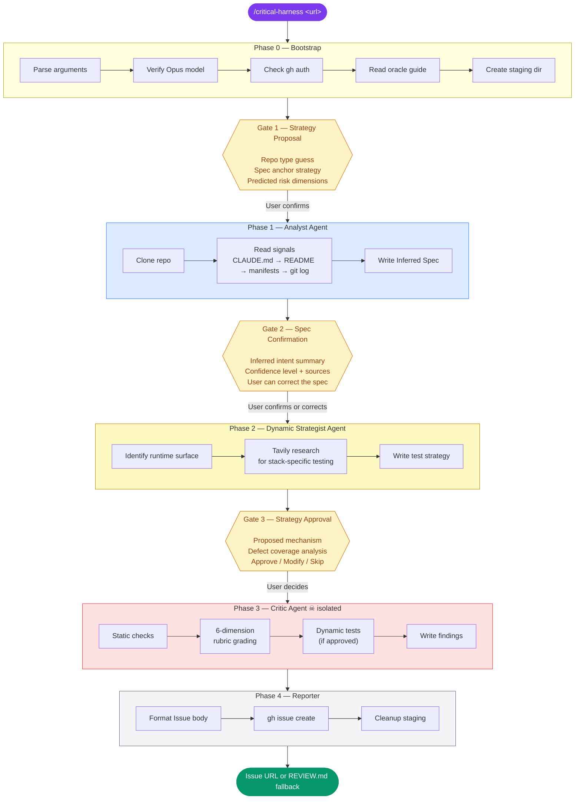
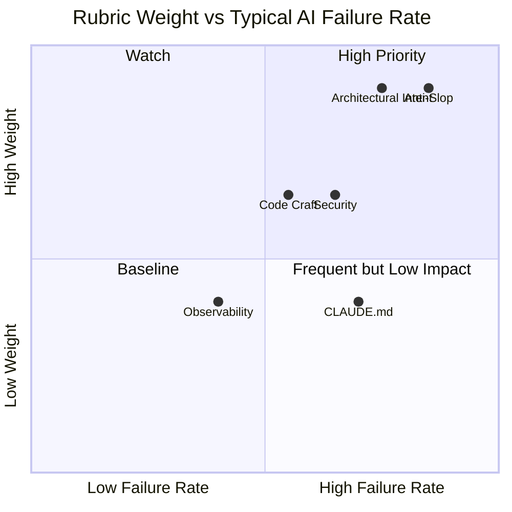
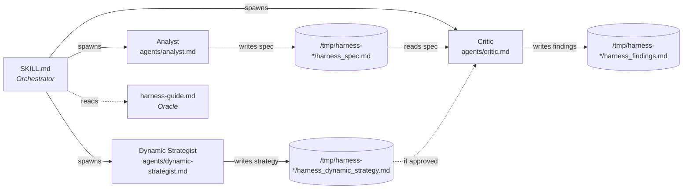

<p align="center">
  <strong>Critical Harness</strong>
</p>

<p align="center">
  <em>Adversarial quality review for any GitHub repository, delivered as a Claude Code skill.</em>
</p>

<p align="center">
  
  
  
  
  
</p>

<p align="center">
  
  
  
</p>

---

Point it at a repo. It infers what the project is supposed to be, grades it against that intent across six weighted dimensions, and opens a GitHub Issue with every finding pinned to a file and line — ready for an autonomous fix session.

> **Why does this exist?** Models are constitutionally bad at evaluating their own work. Anthropic's research shows they "confidently praise the work — even when quality is obviously mediocre." The fix is not better prompting. It is structural separation: the agent that infers intent never grades the code. The agent that grades the code never sees the reasoning behind the spec. This skill enforces that separation at the infrastructure level.

---

## What You Get

A structured GitHub Issue with scored dimensions, file:line findings, and fix instructions:

```
Harness Review — my-project — 2026-03-31

Spec Confidence: HIGH (anchored on .claude/CLAUDE.md)

| # | Dimension                    | Score | Status |
|---|------------------------------|-------|--------|
| 1 | Architectural Intent Match   |  6.5  |  WARN  |
| 2 | Intentionality / Anti-Slop   |  5.0  |  WARN  |
| 3 | Code Craft                   |  7.5  |  PASS  |
| 4 | Security Posture             |  4.0  |  FAIL  |
| 5 | CLAUDE.md Completeness       |  3.0  |  FAIL  |
| 6 | Observability & Testability  |  7.0  |  PASS  |

Weighted Overall: 5.6 / 10.0
```

```
CRITICAL:
  [SECURITY] src/config.ts:42 — AWS key hardcoded in config object
  [CLAUDE.md] .claude/CLAUDE.md — 12 lines, all boilerplate, no architecture docs

WARNING:
  [INTENT] src/routes/ — 3 endpoints not referenced in README feature list
  [SLOP] src/utils/helpers.ts — 47-line generic error handler unused by any caller

Fix Session Instructions:
  1. Start with CRITICAL findings
  2. Work WARNINGs in listed order
  3. Re-run: /critical-harness https://github.com/org/my-project
```

Every finding carries a concrete fix instruction. A follow-up Claude Code session can read the Issue and implement all fixes without asking for context.

---

## Quick Start

### Install

```bash
gh repo clone hashbulla/critical-harness ~/.claude/skills/critical-harness
```

Claude Code discovers the skill automatically. No restart needed.

### Run

```bash
# Let the harness infer project intent
/critical-harness https://github.com/org/repo-name

# Or provide your own product brief
/critical-harness https://github.com/org/repo-name --spec "A REST API for product catalog data. 1k rps. JWT auth."
```

### Prerequisites

| Requirement | Why | Check |
|:------------|:----|:------|
|  | Runtime for the skill | `claude --version` |
|  | Evaluation depth requires it — skill halts otherwise | `/model opus` |
|  | Clones repo, creates output Issue | `gh auth status` |
|  | Powers Dynamic Strategist phase | Visible in `/mcp` |

> No Tavily? Skip dynamic testing at Gate 3 — the core static evaluation is unaffected.

---

## Pipeline



### The Three Gates

| Gate | Purpose | Time |
|:-----|:--------|:-----|
|  | Catches bad assumptions before cloning | ~10s |
|  | **Load-bearing** — wrong spec poisons every finding | ~20s |
|  | Skip dynamic testing when it adds no value | ~10s |

You are not babysitting. You are steering. Three decisions, under a minute total.

---

## Rubric

Six dimensions, weighted by where AI-generated code most commonly fails:



| # | Dimension | Weight | What it catches |
|:-:|:----------|:------:|:----------------|
| 1 | **Architectural Intent Match** | `2x` | Does the code do what the README says? Scope creep, missing features, structural contradictions. |
| 2 | **Intentionality / Anti-Slop** | `2x` | Boilerplate nobody needs, AI-generated patterns applied without thought, TODO in production. |
| 3 | **Code Craft** | `1.5x` | Missing error handling, DRY violations, dead code, silent failures. |
| 4 | **Security Posture** | `1.5x` | Hardcoded secrets, insecure defaults, missing input validation. Auto-escalates to CRITICAL. |
| 5 | **CLAUDE.md Completeness** | `1x` | Would a new agent session understand this project from the context file? |
| 6 | **Observability & Testability** | `1x` | Tests, structured logging, health checks. Can you tell from outside it works? |

> **Scoring:** 1-10 per dimension, half-points allowed. **Pass** >= 7.0. **Below 5.0** auto-escalates to CRITICAL. Overall = weighted mean.

The Critic is constitutionally skeptical: no credit for intent, no rounding up, file:line evidence required on every finding. Findings without evidence are marked Unknown — never fabricated.

---

## Architecture



**Why three agents?** The Analyst writes a spec. The Critic reads only that spec and the codebase — it never sees the Analyst's thought process. Enforced via `isolation: worktree` at the infrastructure level, not by prompt instruction. Each agent has its own `model: opus` declaration and restricted tool access.

### File Structure

```
~/.claude/skills/critical-harness/
├── SKILL.md                          # Orchestrator — pipeline, gates, reporter
├── agents/
│   ├── analyst.md                    # Spec inference (model: opus)
│   ├── dynamic-strategist.md         # Tavily-powered test strategy (model: opus)
│   └── critic.md                     # Adversarial grader (model: opus, read-only)
└── references/
    └── harness-guide.md              # Evaluation philosophy, rubric, failure modes
```

---

## Troubleshooting

<details>
<summary><strong>"This harness requires Opus-class reasoning capacity"</strong></summary>

The skill checks the active model at startup. Switch to Opus and re-invoke:

```
/model opus
/critical-harness https://github.com/org/repo
```
</details>

<details>
<summary><strong><code>gh issue create</code> fails</strong></summary>

The Reporter writes `REVIEW.md` as a fallback. Create the Issue manually:

```bash
gh issue create --repo <url> --title "Harness Review — ..." --body-file REVIEW.md
```
</details>

<details>
<summary><strong>Tavily tools not available</strong></summary>

At Gate 3, choose "Skip dynamic testing." The core 6-dimension static evaluation runs without Tavily.
</details>

<details>
<summary><strong>LOW confidence spec</strong></summary>

The repo had no CLAUDE.md, a thin README, and limited git history. The harness grades dimension 1 conservatively. Provide `--spec` to bypass inference entirely.
</details>

---

## Extending

| Goal | How |
|:-----|:----|
| **Tune scoring** | Edit `agents/critic.md` — adjust weights, thresholds, or penalization criteria per dimension |
| **Add a dimension** | Add a new section in `agents/critic.md`, update the scoring table and `references/harness-guide.md` |
| **Swap the Strategist** | Replace `agents/dynamic-strategist.md` or remove the Phase 2 block from `SKILL.md` |
| **Private repos** | Works out of the box if `gh auth status` shows access to the target repo |

---

## Roadmap

| Status | Feature |
|:------:|:--------|
|  | Multi-agent pipeline with structural separation |
|  | 6-dimension rubric with constitutional skepticism |
|  | Worktree-isolated Critic agent |
|  | Tavily-powered dynamic test strategy |
|  | DevSecOps CI gate — deterministic static checks as GitHub Action ([#1](https://github.com/hashbulla/critical-harness/issues/1)) |
|  | `--ci` flag for scheduled headless runs |
|  | Panel model — multiple reviewer personas for finding generation |
|  | Calibration loop — tune Critic against human judgment baselines |

---

## Research Foundation

This skill implements patterns from Anthropic's published engineering research:

| Paper | Key Concept Used |
|:------|:-----------------|
| [Harness design for long-running apps](https://www.anthropic.com/engineering/harness-design-long-running-apps) | Planner/Generator/Evaluator pipeline, self-evaluation bias, evaluator calibration |
| [Demystifying evals for AI agents](https://www.anthropic.com/engineering/demystifying-evals-for-ai-agents) | Grader types, isolated per-criterion scoring, Unknown fallback |
| [Multi-agent research system](https://www.anthropic.com/engineering/multi-agent-research-system) | Isolated scoring outperforms aggregated panels |
| [Effective harnesses for long-running agents](https://www.anthropic.com/engineering/effective-harnesses-for-long-running-agents) | Context reset, "getting up to speed" sequence |

Full annotated synthesis: [`references/harness-guide.md`](references/harness-guide.md)

---

<p align="center">
  
</p>
